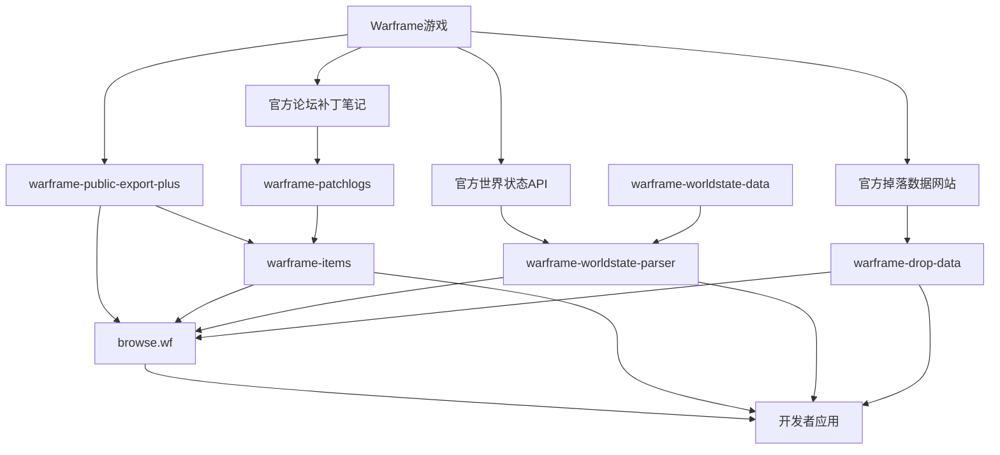

# ModernWarframe 子模块详细介绍

本目录包含了 ModernWarframe 项目中所有子模块的详细介绍文档。这些子模块构成了一个完整的 Warframe 数据生态系统，为开发者和社区提供了全面的游戏数据支持。

## 子模块概览

### 核心数据源
1. **[warframe-public-export-plus](warframe-public-export-plus.md)** - 最完整的 Warframe 游戏数据源
2. **[warframe-items](warframe-items.md)** - 全面的物品数据库和API
3. **[warframe-drop-data](warframe-drop-data.md)** - 掉落率和奖励数据

### 实时数据处理
4. **[warframe-worldstate-parser](warframe-worldstate-parser.md)** - 世界状态数据解析器
5. **[warframe-worldstate-data](warframe-worldstate-data.md)** - 世界状态解析所需的映射数据

### 历史数据
6. **[warframe-patchlogs](warframe-patchlogs.md)** - 补丁日志解析和物品变更历史

### 用户界面
7. **[browse.wf](browse.wf.md)** - Web端数据浏览和查询工具

## 数据流向图



## 项目关系说明

### 1. 数据基础层
- **warframe-public-export-plus**: 提供最原始、最完整的游戏数据
- **warframe-worldstate-data**: 提供ID映射和本地化数据
- **warframe-patchlogs**: 提供历史变更数据

### 2. 数据处理层
- **warframe-items**: 整合多种数据源，提供标准化的物品数据
- **warframe-worldstate-parser**: 解析实时世界状态数据
- **warframe-drop-data**: 解析和标准化掉落率数据

### 3. 应用展示层
- **browse.wf**: 提供Web端的数据浏览和查询界面

## 技术架构特点

### 数据完整性
- **多源集成**: 从多个官方数据源获取信息，确保数据完整性
- **交叉验证**: 不同数据源之间相互验证，提高数据准确性
- **版本控制**: 跟踪数据变化，维护历史版本

### 实时性
- **自动更新**: 监控游戏更新，自动获取最新数据
- **增量处理**: 只处理变化的数据，提高效率
- **缓存机制**: 多级缓存提高数据访问速度

### 扩展性
- **模块化设计**: 每个子模块职责明确，便于独立开发和维护
- **标准化接口**: 统一的数据格式和API接口
- **插件支持**: 支持第三方扩展和定制

## 使用场景

### 开发者应用
```javascript
// 综合使用示例
import Items from '@wfcd/items';
import WorldStateParser from 'warframe-worldstate-parser';
import dropData from 'warframe-drop-data';

// 获取物品数据
const items = new Items();
const excalibur = items.find(item => item.name === 'Excalibur');

// 获取实时数据
const worldState = await WorldStateParser(worldStateData);
const alerts = worldState.alerts;

// 获取掉落数据
const hydronDrops = await fetch('/api/drops/sedna/hydron').then(r => r.json());

// 构建应用
const gameHelper = {
  items,
  worldState,
  drops: dropData
};
```

### 数据分析
```javascript
// 数据分析示例
const analytics = {
  // 武器平衡性分析
  analyzeWeaponBalance: (weapons) => {
    return weapons.map(weapon => ({
      name: weapon.name,
      dps: calculateDPS(weapon),
      efficiency: calculateEfficiency(weapon)
    }));
  },
  
  // 掉落率分析
  analyzeDropRates: (drops) => {
    return drops.map(drop => ({
      item: drop.itemName,
      location: drop.location,
      efficiency: calculateFarmEfficiency(drop)
    }));
  },
  
  // 市场趋势分析
  analyzeMarketTrends: (patchlogs) => {
    return analyzePriceImpact(patchlogs);
  }
};
```

## 社区生态

### WFCD (Warframe Community Developers)
大部分子模块由 WFCD 社区维护：
- **开放协作**: 欢迎社区贡献代码和数据
- **标准制定**: 制定数据格式和API标准
- **质量保证**: 社区审核确保数据质量
- **技术支持**: 为开发者提供技术支持

### 第三方贡献者
- **Calamity Inc.**: 维护 warframe-public-export-plus 和 browse.wf
- **社区开发者**: 贡献各种改进和新功能
- **数据验证**: 社区帮助验证和改进数据准确性

## 部署建议

### 开发环境
```bash
# 克隆项目
git clone --recursive https://github.com/wxhn1225/ModernWarframe.git
cd ModernWarframe

# 初始化所有子模块
git submodule update --init --recursive

# 安装依赖（如果需要）
# 每个子模块可能有自己的依赖
cd deps/warframe-items && npm install
cd ../warframe-worldstate-parser && npm install
# ... 其他子模块
```

### 生产环境
```bash
# 数据更新策略
# 1. 定时更新静态数据
0 */6 * * * cd /path/to/warframe-items && npm run build

# 2. 实时更新世界状态
*/5 * * * * curl -s https://content.warframe.com/dynamic/worldState.php > worldstate.json

# 3. 每日更新掉落数据
0 2 * * * cd /path/to/warframe-drop-data && node generateData.js
```

## 性能优化

### 缓存策略
```javascript
// 多级缓存示例
const cacheStrategy = {
  // L1: 内存缓存 (最快)
  memory: new Map(),
  
  // L2: 本地文件缓存
  file: require('./file-cache'),
  
  // L3: 分布式缓存 (Redis)
  distributed: require('./redis-cache'),
  
  async get(key) {
    // 按优先级查找缓存
    return this.memory.get(key) ||
           await this.file.get(key) ||
           await this.distributed.get(key);
  }
};
```

### 数据压缩
```javascript
// 数据压缩和分页
const dataOptimization = {
  // 按需加载
  loadOnDemand: (category) => require(`./data/${category}.json`),
  
  // 数据分页
  paginate: (data, page, size) => {
    const start = (page - 1) * size;
    return data.slice(start, start + size);
  },
  
  // 数据压缩
  compress: (data) => require('lz-string').compress(JSON.stringify(data))
};
```

## 监控与维护

### 数据质量监控
```javascript
const monitoring = {
  // 数据完整性检查
  checkDataIntegrity: () => {
    // 检查必需字段
    // 验证数据关联
    // 检测异常值
  },
  
  // 更新频率监控
  checkUpdateFrequency: () => {
    // 监控数据更新时间
    // 检测更新失败
    // 发送告警通知
  },
  
  // 性能监控
  monitorPerformance: () => {
    // API响应时间
    // 数据加载速度
    // 内存使用情况
  }
};
```

## 扩展开发

### 添加新数据源
```javascript
// 新数据源集成示例
class NewDataSource {
  constructor() {
    this.api = 'https://new-api-endpoint.com';
  }
  
  async fetchData() {
    const response = await fetch(this.api);
    return this.processData(await response.json());
  }
  
  processData(rawData) {
    // 数据标准化处理
    return rawData.map(item => ({
      id: item.uniqueName,
      name: item.displayName,
      // 其他标准字段...
    }));
  }
}
```

### 自定义解析器
```javascript
// 自定义世界状态解析器
class CustomWorldStateParser extends BaseParser {
  parseCustomEvent(data) {
    return {
      id: data.id,
      name: data.name,
      active: !data.expired,
      // 自定义字段...
    };
  }
}
```

## 贡献指南

### 代码贡献
1. Fork 相应的子模块仓库
2. 创建功能分支
3. 提交更改并创建 Pull Request
4. 等待代码审查和合并

### 数据验证
1. 报告数据错误或不一致
2. 提供更准确的数据源
3. 帮助验证新数据的准确性

### 文档改进
1. 改进现有文档
2. 添加使用示例
3. 翻译为其他语言

## 许可证信息

各子模块使用不同的许可证：
- **WFCD项目**: 主要使用 MIT 许可证
- **Calamity Inc.项目**: 具体许可证请查看各项目仓库
- **整体项目**: 遵循各子模块的许可证要求

## 联系方式

- **WFCD Discord**: https://discord.gg/jGZxH9f
- **GitHub组织**: https://github.com/WFCD
- **项目主页**: https://github.com/wxhn1225/ModernWarframe

---

这个生态系统为 Warframe 社区提供了完整的数据基础设施，使开发者能够轻松构建各种游戏相关应用。无论是简单的数据查询还是复杂的分析工具，这些子模块都提供了强大的支持。 