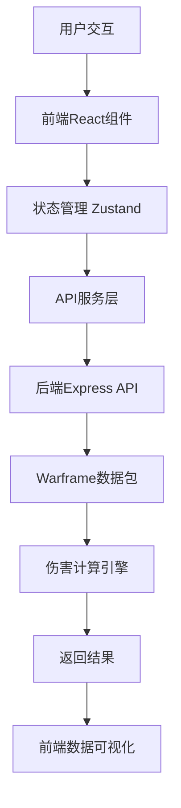

# 伤害计算器模块 🎯

ModernWarframe项目的伤害计算器模块，提供交互式的Warframe伤害机制学习工具。

## 📋 模块概述

### 核心功能
- **伤害层级可视化**：圆形图标展示基伤、元素、护甲、量化、外围等伤害层级
- **MOD拖拽系统**：拖拽MOD到对应图标，实时计算伤害
- **闯关教学模式**：循序渐进的伤害机制学习
- **敌人数据系统**：选择不同敌人类型和等级
- **实时伤害计算**：精确的伤害计算和验证

### 交互体验
- 🎯 游戏化的MOD拖拽交互
- 📊 实时伤害数据可视化
- 🎓 渐进式学习模式
- 🔍 详细的计算过程展示

## 🏗️ 模块架构

```
warframe-damage-calculator/
├── backend/                 # 后端API服务
│   ├── server.js           # Express服务器
│   ├── routes/             # API路由
│   ├── services/          # 业务逻辑服务
│   ├── data/              # 数据缓存
│   └── utils/             # 工具函数
├── frontend/              # 前端React应用
│   ├── src/
│   │   ├── components/    # React组件
│   │   ├── hooks/         # 自定义Hooks
│   │   ├── services/      # API服务
│   │   ├── utils/         # 工具函数
│   │   └── types/         # TypeScript类型定义
│   └── public/            # 静态资源
└── shared/                # 共享类型和工具
```

## 🛠️ 技术栈

### 后端技术
- **运行环境**: Node.js v18+
- **框架**: Express.js v4.18+
- **数据源**: 
  - `warframe-public-export-plus` - 官方数据导出
  - `warframe-worldstate-data` - 世界状态数据
  - `@wfcd/items` - 物品数据库
  - `warframe-riven-info` - 紫卡数据
- **实时数据API**: 
  - [Oracle Browse.wf API](https://oracle.browse.wf/) - 实时游戏状态数据
  - 支持世界状态、入侵、每周任务等数据

### 前端技术
- **框架**: React v18 + TypeScript
- **状态管理**: Zustand
- **UI组件库**: Ant Design v5
- **拖拽交互**: react-beautiful-dnd
- **动画效果**: Framer Motion
- **数据请求**: SWR (Stale-While-Revalidate)
- **图表可视化**: Recharts
- **构建工具**: Vite

### 开发工具
- **代码规范**: ESLint + Prettier
- **类型检查**: TypeScript
- **测试框架**: Jest + React Testing Library
- **版本控制**: Git
- **包管理**: npm

## 🔧 核心功能模块

### 1. 伤害层级可视化 (DamageIcons)
```typescript
interface DamageLayer {
  id: string;
  name: string;
  type: 'base' | 'elemental' | 'armor' | 'quantified' | 'peripheral';
  icon: React.ComponentType;
  mods: Mod[];
  multiplier: number;
}
```

### 2. MOD拖拽系统 (ModLibrary)
```typescript
interface ModDragSystem {
  modLibrary: Mod[];
  draggedMod: Mod | null;
  dropZones: DamageLayer[];
  onDrop: (mod: Mod, target: DamageLayer) => void;
  validation: (mod: Mod, target: DamageLayer) => boolean;
}
```

### 3. 伤害计算引擎 (DamageCalculator)
```typescript
interface DamageCalculation {
  baseDamage: number;
  elementalDamage: ElementalDamage;
  criticalChance: number;
  criticalMultiplier: number;
  statusChance: number;
  armorReduction: number;
  finalDamage: number;
  steps: CalculationStep[];
}
```

### 4. 敌人数据系统 (EnemySelector)
```typescript
interface Enemy {
  id: string;
  name: string;
  type: string;
  level: number;
  health: number;
  armor: number;
  shields: number;
  resistances: Resistance[];
}
```

## 📊 数据流架构



## 🚀 开发进度

### 已完成
- [ ] 模块结构搭建
- [ ] 后端API基础框架
- [ ] 前端React应用初始化
- [ ] Warframe数据包集成

### 待开发
- [ ] 伤害层级图标设计与实现
- [ ] MOD拖拽交互系统
- [ ] 伤害计算引擎
- [ ] 敌人数据选择器
- [ ] 实时计算结果展示
- [ ] 闯关教学模式

## 🎯 用户体验设计

### 交互流程
1. **选择武器** → 显示基础伤害数据
2. **拖拽MOD** → 实时更新伤害计算
3. **选择敌人** → 显示对应的防御数据
4. **查看结果** → 详细的伤害分解和建议

### 视觉设计
- **伤害图标**：圆形设计，不同颜色代表不同伤害层级
- **MOD卡片**：卡片式设计，支持拖拽和悬浮预览
- **伤害数据**：实时更新的数据可视化图表
- **教学模式**：游戏化的界面设计

## 🔄 数据来源

### 外部API集成

#### Oracle Browse.wf API
项目集成了 [Oracle Browse.wf](https://oracle.browse.wf/) 提供的实时Warframe数据API：

**可用接口：**
- `worldState.json` - 游戏世界状态（每分钟刷新）
- `invasions` - 入侵事件数据
- `weekly` - 每周任务数据
- `redtext.json` - 游戏公告数据

### 数据缓存策略
- 本地数据缓存减少API调用频率
- 实时数据通过Oracle API获取
- 静态数据通过npm包提供

## 🚀 使用说明

### 环境要求
- Node.js v18+
- npm v8+

### 安装依赖
```bash
# 安装后端依赖
cd warframe-damage-calculator/backend
npm install

# 安装前端依赖
cd ../frontend
npm install
```

### 开发模式
```bash
# 启动后端服务
cd warframe-damage-calculator/backend
npm run dev

# 启动前端应用
cd ../frontend
npm run dev
```

## 🔗 相关技术文档

- [React官方文档](https://react.dev/)
- [Express官方文档](https://expressjs.com/)
- [Oracle Browse.wf API](https://oracle.browse.wf/) 